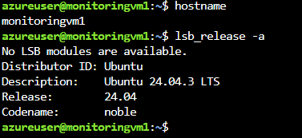
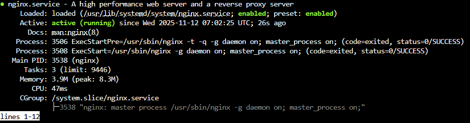

# Azure VM Web Server Project

This project demonstrates how to deploy and configure a web server on a Linux Virtual Machine in Microsoft Azure.

## Quick look
A simple Nginx-based static site is hosted on an Azure Ubuntu VM. The project shows skills in:
- Azure virtual machine deployment
- Linux server configuration
- Networking and NSG management
- Web server setup and HTTP access

## Project Screenshots

Here’s a quick look at my Azure VM deployment and the Nginx web page in action.

### Ubuntu Server Running

### Nginx Active and Running

### Web Page Live in Browser

## Steps
1. Created a resource group and Ubuntu VM (D2_v3)
2. Connected via SSH from the Azure Cloud Shell
3. Installed and configured Nginx
4. Added an inbound port rule for HTTP (port 80)
5. Deployed a custom static HTML site

## Tools & Skills used

- Azure Resource Groups: organized and managed related project assets
- Azure Virtual Machines (Ubuntu Linux): hosted and served the web page
- Azure Network Security Groups (NSG): configured inbound rules to allow HTTP traffic on port 80
- Nginx Web Server: installed and configured to deliver static web content
- Azure Cloud Shell / Bash CLI: handled deployments, configurations, and verification tasks
- Linux Administration: connected via SSH, managed the server, and verified service status
- Firewall Configuration: opened only necessary ports to ensure secure access
